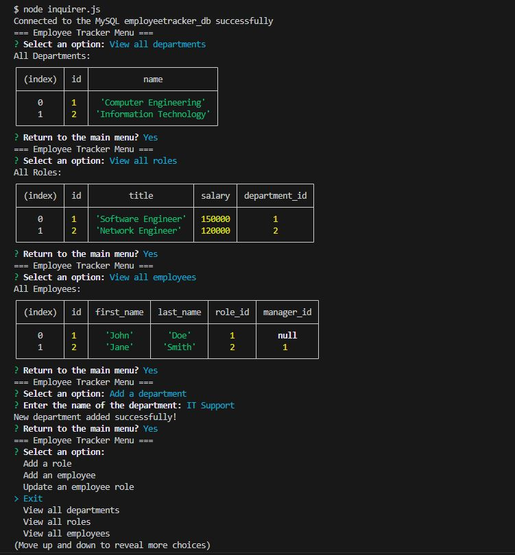

# SQL-Employee-Tracker
  [](https://opensource.org/licenses/MIT)   

Using MySql to store employee data, users will be able to view, add, and update to track employees of a company.

## Description
* Created an application using mysql2, inquirer, and console.table.
* Used the inquirer to complete the CRUD method with update, create, delete, and request from MySQL database.
* Created MySQL database using schema.sql and creating necessary tables with associations/references.
* Using Node.JS to run the command-line with inquirer prompts.
* Able to create a new employee, add new manager, add new department, add new roles, update employees, and view all necessary tables.

## Table of Contents
- [Installation](#installation)
- [Usage](#usage)

- [Screenshot/Video](#screenshotvideo)
- [Deployed APP](#deployed-application)
- [Contributing](#contributing)
- [License](#license)
- [Questions](#questions)

## Installation
* _Run in terminal_:
> npm install

* _Run in terminal_:
> mysql -u username -p

* _Source your schema_:
> source db/schema.sql;

* _Run in terminal_:
> node inquirer.js

## Usage
Running the inquirer.js file will prompt you on options on what to do with the MySQL database. You can choose either to view departments, view roles, view employees, and the options to update or add to respective categories. Exiting the inquirier prompt will exit you out of the server. ```You must enter your password for your MySQL database in the inquirer.js file under the connection variable.```


## Screenshot/Video




## Deployed Application
- [Employee-Tracker Video Walk-through](https://youtu.be/pwFY5M-SKzM)
- [Employee-Tracker Repo](https://github.com/SithHun/SQL-Employee-Tracker)

## Contributing
*A list of contributors on this project includes:*

* [Sith Hun](https://github.com/SithHun)


*Third-party applications used to create this project:*
* [MySQL](#mysql)
* [Inquirer](#inquirer)
* [Console.Table](#console.table)

## License
*This project is licensed under the MIT.*


## Questions
If you have any questions, you can reach out to me via GitHub: [@SithHun](https://github.com/SithHun)

Feel free to contact me via email: sithsun@gmail.com

<br>

> *Credits: This ReadMe was created with ❤️ by [Professional-ReadMe-Generator](https://github.com/SithHun/Professional-ReadMe-Generator)*
